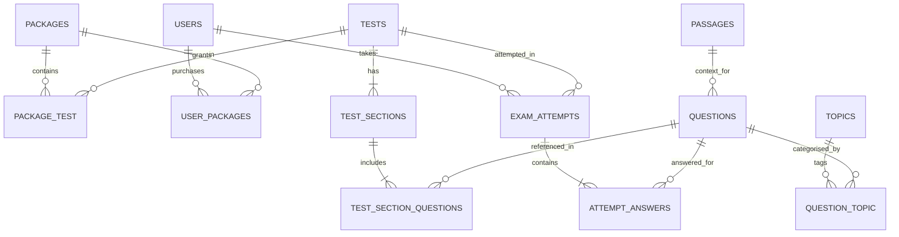

# Database Schema & Data Architecture

## Design Principles
- **Lean & Normalized**: No redundant or multi-purpose overloaded columns.
- **Decoupled Passages**: Shared RC and DILR caselets stored once in `passages`.
- **Snapshot Tests**: Question selection locked via `test_section_questions`.
- **Flat Topic Tagging**: Simple many-to-many topic association (`question_topic`).

---

## Entity Relationship Summary

---

## Tables & Columns Specification

### 1. `users`
- `id`: `BIGINT UNSIGNED AUTO_INCREMENT PRIMARY KEY`
- `name`: `VARCHAR(255)`
- `email`: `VARCHAR(255) UNIQUE`
- `password`: `VARCHAR(255)`
- `role`: `ENUM('admin', 'student') DEFAULT 'student'`
- `created_at`, `updated_at`: `TIMESTAMP`

### 2. `topics`
- `id`: `BIGINT UNSIGNED AUTO_INCREMENT PRIMARY KEY`
- `name`: `VARCHAR(255)`
- `slug`: `VARCHAR(255) UNIQUE`
- `created_at`, `updated_at`: `TIMESTAMP`

### 3. `passages`
- `id`: `BIGINT UNSIGNED AUTO_INCREMENT PRIMARY KEY`
- `section_category`: `VARCHAR(50)` (e.g. `va`, `dilr`)
- `content`: `LONGTEXT` (HTML rich content/tables/data sets)
- `created_at`, `updated_at`: `TIMESTAMP`

### 4. `questions`
- `id`: `BIGINT UNSIGNED AUTO_INCREMENT PRIMARY KEY`
- `passage_id`: `BIGINT UNSIGNED NULLABLE FK -> passages(id) ON DELETE SET NULL`
- `section_category`: `VARCHAR(50)` (e.g. `va`, `dilr`, `qa`)
- `type`: `ENUM('mcq', 'tita') DEFAULT 'mcq'`
- `content`: `LONGTEXT` (HTML)
- `options`: `JSON NULLABLE` (e.g. `[{"id": "A", "text": "Option A"}, ...]`, null for TITA)
- `correct_answer`: `TEXT`
- `explanation`: `LONGTEXT NULLABLE` (HTML)
- `difficulty`: `TINYINT UNSIGNED` (1 to 5)
- `created_at`, `updated_at`: `TIMESTAMP`

### 5. `question_topic` (Pivot)
- `question_id`: `BIGINT UNSIGNED FK -> questions(id) ON DELETE CASCADE`
- `topic_id`: `BIGINT UNSIGNED FK -> topics(id) ON DELETE CASCADE`
- `PRIMARY KEY (question_id, topic_id)`

### 6. `tests`
- `id`: `BIGINT UNSIGNED AUTO_INCREMENT PRIMARY KEY`
- `title`: `VARCHAR(255)`
- `slug`: `VARCHAR(255) UNIQUE`
- `category`: `VARCHAR(50)` (e.g. `cat`, `cmat`, `xat`)
- `total_duration_minutes`: `INT UNSIGNED`
- `has_calculator`: `BOOLEAN DEFAULT TRUE`
- `is_published`: `BOOLEAN DEFAULT FALSE`
- `created_at`, `updated_at`: `TIMESTAMP`

### 7. `test_sections`
- `id`: `BIGINT UNSIGNED AUTO_INCREMENT PRIMARY KEY`
- `test_id`: `BIGINT UNSIGNED FK -> tests(id) ON DELETE CASCADE`
- `name`: `VARCHAR(100)` (e.g. `Verbal Ability`, `Data Interpretation & Logical Reasoning`, `Quantitative Aptitude`)
- `order`: `TINYINT UNSIGNED`
- `duration_minutes`: `INT UNSIGNED`
- `correct_marks`: `DECIMAL(4,2) DEFAULT 3.00`
- `negative_mcq_marks`: `DECIMAL(4,2) DEFAULT 1.00`
- `negative_tita_marks`: `DECIMAL(4,2) DEFAULT 0.00`
- `is_section_locked`: `BOOLEAN DEFAULT TRUE` (Timed lock: cannot leave section until timer expires)
- `allow_return`: `BOOLEAN DEFAULT FALSE` (Cannot return to previous section once completed)
- `instructions`: `TEXT NULLABLE`
- `created_at`, `updated_at`: `TIMESTAMP`

### 8. `test_section_questions` (Snapshot Pivot)
- `id`: `BIGINT UNSIGNED AUTO_INCREMENT PRIMARY KEY`
- `test_section_id`: `BIGINT UNSIGNED FK -> test_sections(id) ON DELETE CASCADE`
- `question_id`: `BIGINT UNSIGNED FK -> questions(id) ON DELETE CASCADE`
- `order`: `INT UNSIGNED`
- `UNIQUE KEY (test_section_id, question_id)`

### 9. `packages` (Test Series)
- `id`: `BIGINT UNSIGNED AUTO_INCREMENT PRIMARY KEY`
- `title`: `VARCHAR(255)`
- `slug`: `VARCHAR(255) UNIQUE`
- `description`: `TEXT NULLABLE`
- `price`: `DECIMAL(8,2) DEFAULT 0.00`
- `is_free`: `BOOLEAN DEFAULT FALSE`
- `is_published`: `BOOLEAN DEFAULT FALSE`
- `created_at`, `updated_at`: `TIMESTAMP`

### 10. `package_test` (Pivot)
- `package_id`: `BIGINT UNSIGNED FK -> packages(id) ON DELETE CASCADE`
- `test_id`: `BIGINT UNSIGNED FK -> tests(id) ON DELETE CASCADE`
- `order`: `INT UNSIGNED DEFAULT 1`
- `PRIMARY KEY (package_id, test_id)`

### 11. `user_packages` (Enrollments)
- `id`: `BIGINT UNSIGNED AUTO_INCREMENT PRIMARY KEY`
- `user_id`: `BIGINT UNSIGNED FK -> users(id) ON DELETE CASCADE`
- `package_id`: `BIGINT UNSIGNED FK -> packages(id) ON DELETE CASCADE`
- `expires_at`: `TIMESTAMP NULLABLE`
- `created_at`, `updated_at`: `TIMESTAMP`

### 12. `exam_attempts`
- `id`: `BIGINT UNSIGNED AUTO_INCREMENT PRIMARY KEY`
- `user_id`: `BIGINT UNSIGNED FK -> users(id) ON DELETE CASCADE`
- `test_id`: `BIGINT UNSIGNED FK -> tests(id) ON DELETE CASCADE`
- `status`: `ENUM('in_progress', 'completed') DEFAULT 'in_progress'`
- `started_at`: `TIMESTAMP`
- `submitted_at`: `TIMESTAMP NULLABLE`
- `total_score`: `DECIMAL(6,2) DEFAULT 0.00`
- `created_at`, `updated_at`: `TIMESTAMP`

### 13. `attempt_answers`
- `id`: `BIGINT UNSIGNED AUTO_INCREMENT PRIMARY KEY`
- `attempt_id`: `BIGINT UNSIGNED FK -> exam_attempts(id) ON DELETE CASCADE`
- `test_section_id`: `BIGINT UNSIGNED FK -> test_sections(id) ON DELETE CASCADE`
- `question_id`: `BIGINT UNSIGNED FK -> questions(id) ON DELETE CASCADE`
- `user_answer`: `TEXT NULLABLE`
- `status`: `ENUM('not_visited', 'not_answered', 'answered', 'marked_for_review', 'answered_marked') DEFAULT 'not_visited'`
- `time_spent_seconds`: `INT UNSIGNED DEFAULT 0`
- `is_correct`: `BOOLEAN NULLABLE`
- `marks_awarded`: `DECIMAL(4,2) DEFAULT 0.00`
- `created_at`, `updated_at`: `TIMESTAMP`
- `UNIQUE KEY (attempt_id, question_id)`
